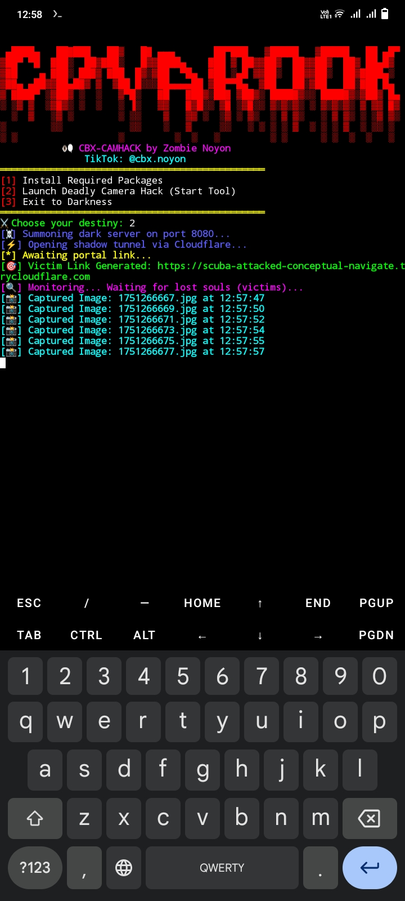
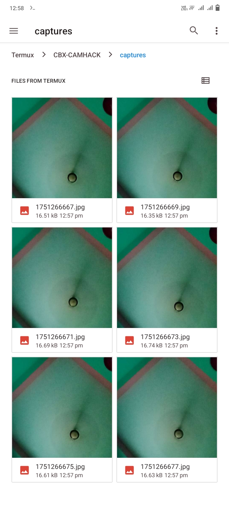

<h1 align="center">
  🕷️ CBX-CAMHACK 🕷️  
</h1>

<p align="center">
  
</p>

<p align="center">
  
  
  
</p>

---

## 🔥 你敢进入黑暗世界吗? (Do you dare enter the dark world?)

> 🧛 **CBX-CAMHACK** হল এক ডেডলি ক্যামেরা ফিশিং টুল যা শুধু **শিক্ষা ও পরীক্ষামূলক ব্যবহারের জন্য।**  
> ⚔️ এটি Termux-এ রান হয় 100% এবং ক্যামেরা এক্সেস, Victim IP, লোকেশন এবং ক্লিক ট্র্যাক করে!  
> ☠️ নামেই যথেষ্ট — **CAMHACK** = "Camera + Hack" = হার্ট অ্যাটাক 😈

---

## 💀 ফিচারসমূহ

- 📸 Victim camera access (with permission)
- 🌐 Live IP & Geolocation tracking
- 🧠 Click counter for every victim
- ⚡ Cloudflared auto-tunneling
- 📦 One-click setup for Termux
- 🕷️ Stylish horror hacking interface
- 🧪 Educational & Testing Only 🔒

---

## 🖼️ স্ক্রিনশট

<p align="center">
  
  <br><br>
  
</p>

---

## ⚙️ ইনস্টলেশন (Install & Run)

```bash
pkg update -y && pkg install git -y
git clone https://github.com/YourUsername/CBX-CAMHACK
cd CBX-CAMHACK
bash start.sh
